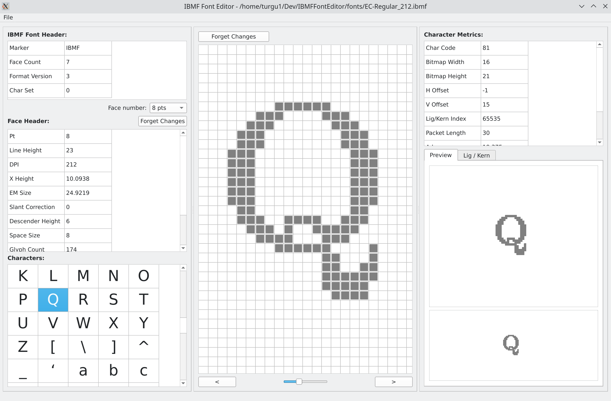

### IBMF Font Editor Version 0.90.0

This is a simple font editor for the IBMF Font format. 
Using QtCreator v9.0.2, Qt v6.4.2 and GCC.

Work in progress. Close to be ready ...

ToDo:

- [x] Run Length Encoding algorithm for glyph' bitmap
- [x] Ligature / Kerning format change in IBMFFont file structure
- [x] ibmf_font.hpp update according to new IBMFFont structure format
- [x] Testing IBMFFont new format (V4) - ongoing
- [x] Edited Font save using date/time suffix on filename
- [x] Algorithm for modified font file saved to disk 
- [ ] Kern and Ligature edition and update
- [ ] Copy / Paste of a glyph
- [x] Connect vertical/horizontal scrollBars to grid positioning
- [x] Add export to .h header file
- [x] Add manual Text entry and formatting with the current font for proofreading.
- [x] Add Undo/Redo capability
- [x] Add Recent documents management
- [x] Add Geometry and Recent documents config management
- [x] Add import capability (TTF)
- [ ] Testing everything (ongoing)

Known bugs:

- [x] Changing currently shown face does modify the face metrics shown, but not the glyphs' bitmaps. Corrected.
- [x] Size information for some widgets not updated by Qt at the expected time. The app must be resized manually to get proper values.
- [x] Glyph Preview widget adjustments required.
- [x] Bitmap renderer (central widget) not positioned properly. The app must be resized to get proper positioning.

#### Main screen capture:

