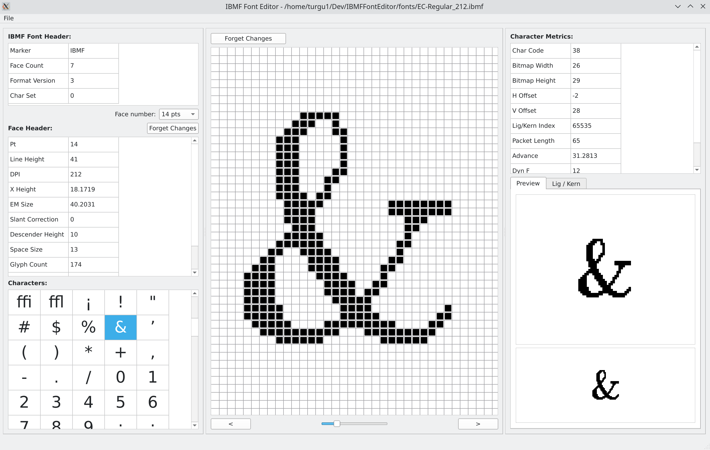

### IBMF Font Editor Version 0.90.0

This is a simple font editor for the IBMF Font format. 
Using QtCreator v9.0.2, Qt v6.4.2 and GCC.

Work in progress. Close to be ready ...

ToDo:

- [x] Run Length Encoding algorithm for glyph' bitmap
- [x] Ligature / Kerning format change in IBMFFont file structure
- [x] Convex Hull optical kerning algorithm
- [x] ibmf_font.hpp update according to new IBMFFont structure format
- [x] Testing IBMFFont new format (V4) - ongoing
- [x] Edited Font save using date/time suffix on filename
- [x] Algorithm for modified font file saved to disk 
- [x] Kerning edition and update
- [ ] Ligature edition and update
- [x] Copy / Paste of a glyph
- [x] Backup of modified glyphs' bitmap, ligature/kerning, and metrics
- [x] Connect vertical/horizontal scrollBars to grid positioning
- [x] Export to .h header file
- [x] Manual Text entry and formatting with the current font for proofreading.
- [x] Undo/Redo capability
- [x] Recent documents management
- [x] Geometry and Recent documents config management
- [x] Import capability (TTF/OTF and HEX Formats)
- [x] Add characters in the private-user block of code points
- [ ] Testing everything (ongoing)
- [ ] Documentation

Known bugs:

- [x] Changing currently shown face does modify the face metrics shown, but not the glyphs' bitmaps. Corrected.
- [x] Size information for some widgets not updated by Qt at the expected time. The app must be resized manually to get proper values.
- [x] Glyph Preview widget adjustments required.
- [x] Bitmap renderer (central widget) not positioned properly. The app must be resized to get proper positioning.
- [ ] Kerning editing (formatting on screen, and saving changes) is not optimal.

#### Main screen capture:

#### Introduction

This application allows for the retrieval of TrueType fonts or GNU Unifont Hex fonts in a pixel-oriented font format (called the IBMF Font Format) that permits the adaptation of glyphs for low-resolution screens without antialiasing capability.

The IBMF Font format permits the definition of up to 10 sizes of glyphs (called faces) and up to 32765 code points per face. It also contains kerning and ligature information. The format uses run-length compression algorithms to minimize the size of the resulting font. A C++ driver is available in a separate project that allow for the inclusion of a font in an embedded application.

The editor allows for the following main operations:

- Import TrueType/OpenType and GNU Hex fonts.
- Export C-Header file for inclusion into an application segment (code or data)
- Edit bitmap and kerning/ligature information for every glyph
- Add specific characters in the private-use main bloc of code points
- Verify results of edition using proofing dialog and text entry

The editor supports undo/redo of modifications done to the current glyph. It also saves application geometry, recent files accessed, and last folder accesses.

##### Main Screen

##### Font Saving

##### Font Import

##### Font Export

##### Glyph Edition

##### Kerning Edition

##### Ligature Edition

##### Proofing

##### Adding characters

The editor allows for the inclusion of new characters in the font. To do so, a `[+]` button is available on top of the character selection table on the bottom left of the main application screen. When clicked, the application will find the next available code point in the private-use block of code points and associate to it a new empty bitmap, metrics, and kerning/ligature structures. The new empty character will then be shown, ready for adding pixels.

The private-use block of code points is located in the range U+0E000 through U+0F8FF. If it is empty, adding a new character will receive code point U+0E000. Adding another character, it will receive code point U+0E001, etc.

To know which code point your new character received, you can move the mouse cursor on top of the character in the character selection table. After a short moment, the editor will display the code point (as U+xxxxx format) and index of that character as a tooltip.

##### Modifications management

The editor maintains two files in synchronization: the main IBMF font file with filename extension `.ibmf`, and the Characters Modifications File with extension `.ibmf_mods`: any time a character is updated in the font, an entry is created in the Characters Modifications File. 

The Characters Modifications File can be used to update a font with modified characters if, for any reason, it must be reloaded from scratch. This usually happens when some blocs of code points are required to be added or removed from an IBMF font. The menu entry `[Tools > Import Modifications File]` permit you to select an existing `.ibmf_mods` file and apply it to the current font. Note that the font will then requires to be saved to conserve the changes made by this function. Also, ONLY CHARACTERS THAT ARE PRESENT IN BOTH THE FONT AND THE MODIFICATIONS FILE WILL BE CONSIDERED FOR RESTORATION IN THE FONT FILE. Once the processing is complete, a dialog is presented with the result log of executing the function. It can be saved in a text file if required.

In the case that the Modifications File doesn't exist for a font, It is possible to generate it as long as the original, non-modified IBMF font was conserved. The menu entry `[Tools > Build Modifications File]` will ask for the original font filename and will regenerate a Moficications File, comparing the current font content with the original font. Again, the font will need to be saved to conserve the changes made by this function. If you added some characters in the private bloc of code points as described in the preceding section, they won't be considered to populate the Modifications File using this function, unless you create them in the original font file as empty characters before using the function. Once the processing is complete, a dialog is presented with the result log of executing the function. It can be saved in a text file if required.

Every time the user saves a font, the name of both files will get the current date and time added to the main filename. This is to ensure that it would be easy to return in time if some saved version of a fond needs to be retrieved. This also permits the rebuilding of the Characters Modifications File as described above. The application will never by itself updates an existing font file. The user can overwrite a filename as the editor will present a dialog to propose the filename it will use. Both the IBMF font and the Modifications File will have their names adjusted to the selected filename.

##### Dump font content for inspection

The Editor offers four functions that permit to dump, in a readable format, the content of an IBMF Font or a Characters Modifications File with or without the character bitmaps. They are located in the `[Tools]` menu. The content will be presented in a dialog that can be saved in a text file if required.