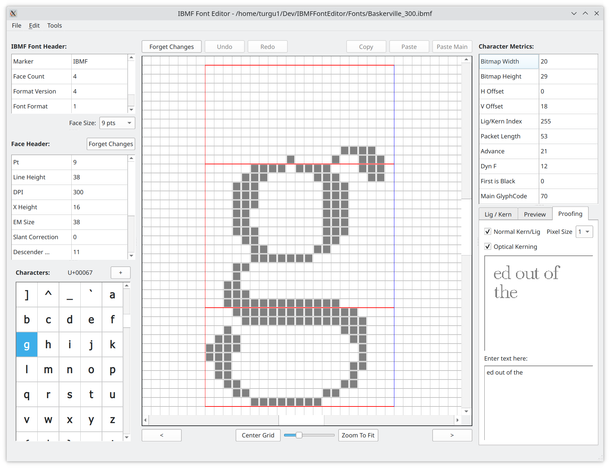

### IBMF Font Editor Version 0.90.0

This is a simple font editor for the IBMF Font format. 
Using QtCreator v9.0.2, Qt v6.4.2 and GCC.

Work in progress. Close to be ready ...

ToDo:

- [x] Run Length Encoding algorithm for glyph' bitmap
- [x] Ligature / Kerning format change in IBMFFont file structure
- [x] ibmf_font.hpp update according to new IBMFFont structure format
- [x] Testing IBMFFont new format (V4) - ongoing
- [x] Edited Font save using date/time suffix on filename
- [x] Algorithm for modified font file saved to disk 
- [x] Kern edition and update
- [ ] Ligature edition and update
- [ ] Copy / Paste of a glyph
- [ ] Backup of modified glyphs and metrics
- [x] Connect vertical/horizontal scrollBars to grid positioning
- [x] Add export to .h header file
- [x] Add manual Text entry and formatting with the current font for proofreading.
- [x] Add Undo/Redo capability
- [x] Add Recent documents management
- [x] Add Geometry and Recent documents config management
- [x] Add import capability (TTF)
- [ ] Testing everything (ongoing)
- [ ] Documentation

Known bugs:

- [x] Changing currently shown face does modify the face metrics shown, but not the glyphs' bitmaps. Corrected.
- [x] Size information for some widgets not updated by Qt at the expected time. The app must be resized manually to get proper values.
- [x] Glyph Preview widget adjustments required.
- [x] Bitmap renderer (central widget) not positioned properly. The app must be resized to get proper positioning.
- [ ] Kerning editing (formatting on screen, and saving changes) is not optimal.

#### Main screen capture:

#### Introduction

This application allows for the retrieval of TrueType fonts or GNU Unifont Hex fonts in a pixel-oriented font format (called the IBMF Font Format) that permits the adaptation of glyphs for low-resolution screens without antialiasing capability.

The IBMF Font format permits the definition of up to 10 sizes of glyphs (called faces) and up to 32765 codepoints per face. It also contains kerning and ligature information. The format uses run-length compression algorithms to minimize the size of the resulting font. A C++ driver is available in a separate project that allow for the inclusion of a font in an embedded application.

The editor allows for the following main operations:

- Import TrueType/OpenType and GNU Hex fonts.
- Export C-Header file for inclusion into an application segment (code or data)
- Edit bitmap and kerning/ligature information for every glyph
- Verify results of edition using proofing dialog and text entry

The editor supports undo/redo of modifications done to the current glyph. It also saves application geometry, recent files accessed, and last folder accesses.

##### Main Screen

##### Font Saving

##### Font Import

##### Font Export

##### Glyph Edition

##### Kerning Edition

##### Ligature Edition

##### Proofing
